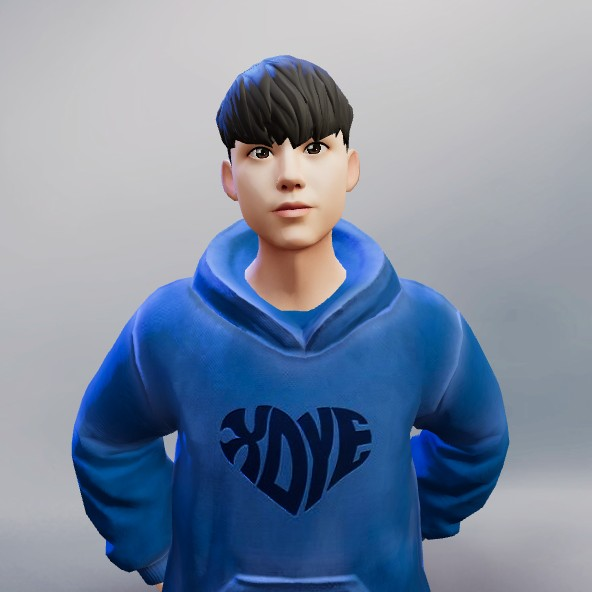

## Hello World, I'm Yoonseop! **🙋**
#### Welcome to my page!
#### Now, I'm a student enrolled in *Dongyang Mirae University* in Seoul, South Korea. 🎒
#### and aspiring to be a **Software Engineer** for web & mobile app. 👨‍💻   
  

## I'm dealing with
    
    
   
  

 

 

 

 

 
## Now I'm focusing on
* understanding computer science about computer architectiure, compiler, network, os
* establishing concepts of programming language grammer for datastructure and algorithm
* building a ci/cd pipeline.
#### Also, you can see my posts about things now I'm focusing on through the next links. so try checking!
  
## Mention
#### I think basic is the most important and awesome idea.
#### Don't forget "1+1=2".
#### Thank you. 👋 

<!--
**gent0807/gent0807** is a ✨ _special_ ✨ repository because its `README.md` (this file) appears on your GitHub profile.

Here are some ideas to get you started:

- 🔭 I’m currently working on ...
- 🌱 I’m currently learning ... 
- 👯 I’m looking to collaborate on ...
- 🤔 I’m looking for help with ...
- 💬 Ask me about ...
- 📫 How to reach me: ...
- 😄 Pronouns: ...
- ⚡ Fun fact: ... 
-->
